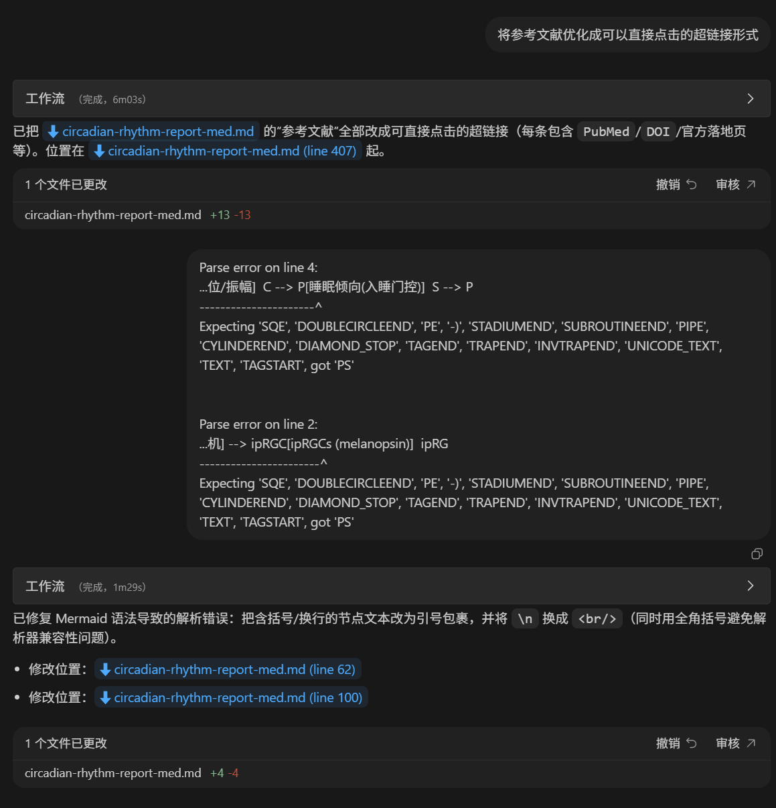
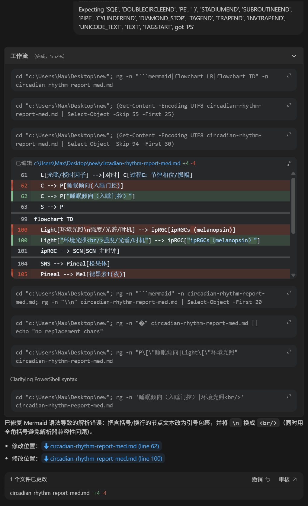

<h1 align="center">Codex Folding</h1>

<table width="100%">
  <tr>
    <td width="33%"></td>
    <td align="center">
      <a href="#"></a>
      <a href="#"></a>
      <a href="LICENSE"></a>
    </td>
    <td width="33%" align="right"><a href="README.md">English</a></td>
  </tr>
</table>

✅ **自动折叠冗长流程 | 支持个性化配置 | AI 一句指令极速安装**  
✅ **隐藏“思考与工具”噪音 | 让对话界面回归清爽**  
✅ **专为 Windows 设计 | 完美兼容 Codex VS Code 官方扩展**  
✅ **无惧官方版本更新 | 插件升级后重新运行安装即可复活**  
✅ **中英双语支持 | 复制下方一句 Prompt 即可安装**  

想拥有一个整洁且便于浏览的codex？厌倦了codex中长长的workflow？超级简单！仅需复制一句话给codex，你就能够在vscode中手动折叠codex的思考与命令执行流程。

<table align="center">
  <tr>
    <td width="50%" align="center">
      
    </td>
    <td width="50%" align="center">
      
    </td>
  </tr>
  <tr>
    <td width="50%" align="center">
      
    </td>
    <td width="50%" align="center">
      
    </td>
  </tr>
  <tr>
    <td width="50%" align="center">
      
    </td>
    <td width="50%" align="center">
      
    </td>
  </tr>
</table>

## 功能特性

| 特性（Emoji + 名称） | 说明 |
| :--- | :--- |
| 🧩 Workflow 折叠 | 将每轮对话的所有过程项聚合到独立 `Workflow` 块中。 |
| ⏱️ 实时计时 | 运行中显示 `进行中/完成`，每 1s 刷新耗时。 |
| ⚙️ 配置开关 | VS Code 设置 `codex.workflow.collapseByDefault = "collapse" | "expand" | "disable"`（安装后默认 `"collapse"`）。 |
| 🧯 可回滚 | 自动生成 `*.bak` 备份，且补丁可重复执行（幂等）。 |

## 使用指南（推荐路径）

1. 把下面的“安装 Prompt”发给你的 AI。
2. （可选）在 VS Code 用户设置中设置 `codex.workflow.collapseByDefault` 为 `"collapse" | "expand" | "disable"`。
3. 重启 VS Code。

## 给 AI 的安装/卸载 Prompt

### 安装 Prompt（发给 AI）
```text
严格按照 https://github.com/MaxMiksa/Codex-Folding/blob/main/docs/INSTALL_FOR_AI.md 的步骤安装该功能，不要自由发挥。
```

### 卸载 Prompt（发给 AI）
```text
严格按照 https://github.com/MaxMiksa/Codex-Folding/blob/main/docs/UNINSTALL_FOR_AI.md 的步骤卸载该功能，不要自由发挥。
```

<details>
  <summary>环境要求与限制</summary>

- 本项目直接 patch 已安装的扩展产物（不要求拿到上游扩展源码并构建）。
- 安装/卸载后需重启 VS Code 才生效。
</details>

<details>
  <summary>开发者指南</summary>

- 运行测试：`npm test`
- 应用补丁：`npm run apply`
- 验证（不落盘）：`npm run verify`
</details>

<details>
  <summary>开发栈</summary>

1. Packages & Frameworks
   - Node.js（ESM）
2. Interfaces & Services
   - VS Code 扩展 host/webview 产物补丁
3. Languages
   - JavaScript, Markdown
</details>

<details>
  <summary>FAQ / 排错</summary>

- 没生效：重启 VS Code。
- 扩展更新后失效：重新执行 `npm run apply`。
</details>

## 🤝 贡献与联系

欢迎提交 Issue 和 Pull Request！  
如有任何问题或建议，请联系 Zheyuan (Max) Kong (卡内基梅隆大学，宾夕法尼亚州)。

Zheyuan (Max) Kong: kongzheyuan@outlook.com | zheyuank@andrew.cmu.edu
